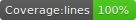
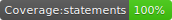

[](https://travis-ci.com/matismasters/dislexicon)





# dislexicon

NPM package to check similarity among strings by counting letters without caring about the order

## Install

```
npm install dislexicon
```

## Usage

```
  // With CommonJS packages
  const Dislexicon = require('dislexicon');

  // With ES6
  import Dislexicon from 'dislexicon'

  console.log(
    Dislexicon.similarityRate('another', 'anthoer')
  ) // ==> 0
```

## Results example

```

  #similarityRate
    ✓ when ["abba","abba"]
      should return 0 (1ms)
    ✓ when ["abba","abbe"]
      should return 0.6666666666666666
    ✓ when ["abba","ccde"]
      should return 1.6
    ✓ when ["$1000","1000"]
      should return 0.3333333333333333
    ✓ when ["Rosario","Rosaro"]
      should return 0.16666666666666666
```

## License

MIT
